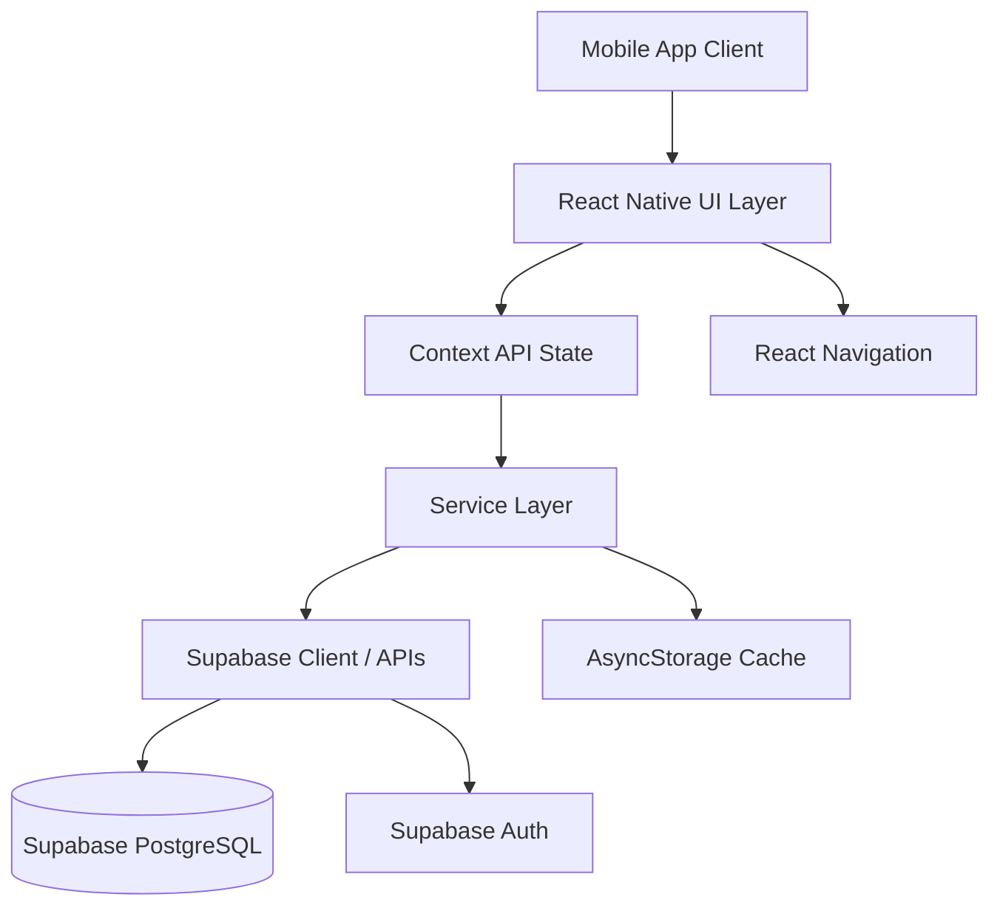

<div align="center">
  

  # 🎓 UniMate

  **The unified, smart academic companion for students.**

  [](https://reactnative.dev/)
  [](https://expo.dev/)
  [](https://supabase.com/)
  [](https://opensource.org/licenses/MIT)

</div>

---

## 📖 Overview

**UniMate** is a comprehensive mobile application built to streamline and centralize the student experience. Originally developed as a Final Year Project for the **University of Sargodha**, it solves the problem of scattered academic resources by bringing schedules, grades, assignments, and announcements into a single, intuitive platform.

Whether you're tracking a critical deadline, checking if your attendance is slipping, or keeping up with department news, UniMate acts as your personal academic assistant.

---

## ✨ Key Features

* **🏠 Smart Dashboard**: Get a daily AI-driven brief, attendance risk alerts, and a quick snapshot of upcoming classes.
* **📅 Schedule Management**: View day-wise and weekly class schedules with "Now" and "Next" indicators.
* **✅ Unified Task Manager**: Track assignments, quizzes, and project deadlines with urgency flags.
* **📊 Grades & GPA Tracking**: Monitor semester-wise results, subject breakdowns, and simulate target GPA goals.
* **📢 Community & Updates**: Stay informed with official department announcements and a dedicated student discussion forum.

---

## 📱 Screenshots

| Home Dashboard | Daily Schedule | Task Management | Academic Profile |
| :---: | :---: | :---: | :---: |
|  |  |  |  |

---

## 🏛️ System Architecture

UniMate follows a modular, component-based architecture built on top of Expo, utilizing a robust global state management system and seamless backend integration.



---

## 💻 Technology Stack

### Frontend
* **Framework**: React Native (Expo)
* **Navigation**: React Navigation (Stacks, Tabs, Drawers)
* **State Management**: React Context API
* **Animations**: React Native Reanimated

### Backend & Infrastructure
* **BaaS Platform**: Supabase
* **Database**: PostgreSQL
* **Authentication**: Supabase Auth

### Local Storage
* **Caching & Config**: React Native AsyncStorage, SecureStore

---

## 📁 Repository Structure

```text
├── src/
│   ├── components/      # Reusable UI elements (Headers, Buttons, Badges)
│   ├── config/          # Environment and Supabase configurations
│   ├── constants/       # App-wide constants (Colors, Sizes, Routes)
│   ├── context/         # Global state (UserContext, NotificationContext)
│   ├── data/            # Mock data and offline fallbacks
│   ├── screens/         # Main application views (grouped by feature)
│   ├── services/        # API clients, auth logic, push notification handlers
│   ├── theme/           # Global stylesheets and typography
│   └── AppNavigator.jsx # Routing configuration
├── App.js               # Application entry point
├── app.json             # Expo configuration
└── package.json         # Dependencies and scripts
```

---

## 🚀 Installation and Setup

### Prerequisites
* **Node.js** (v18 or newer recommended)
* **npm** or **yarn**
* **Expo CLI** (`npm install -g expo-cli`)
* **Expo Go** app installed on your physical device (iOS/Android), or a configured simulator/emulator.

### Setup Instructions

1. **Clone the repository:**
   ```bash
   git clone https://github.com/yourusername/unimate-mobile-frontend.git
   cd unimate-mobile-frontend
   ```

2. **Install dependencies:**
   ```bash
   npm install
   ```

---

## 🔐 Environment Variables

Create a `.env` file in the root of your project and populate it with your Supabase credentials:

```env
EXPO_PUBLIC_SUPABASE_URL=https://your-project-id.supabase.co
EXPO_PUBLIC_SUPABASE_ANON_KEY=your-anon-key
```

*Note: The app is designed with a fallback mechanism and will log a warning if Supabase is not configured, running seamlessly using local mock data for UI testing.*

---

## 🏃 Running the Project

Start the Expo development server:

```bash
npx expo start
```

* Press `a` to open in Android Emulator.
* Press `i` to open in iOS Simulator.
* Scan the QR code using the **Expo Go** app on your physical device.

---

## 🔌 API Overview

The `src/services/apiClient.js` module serves as the central hub for all network activity. It encapsulates:
* **Token Management**: Intercepts requests to append JWT tokens securely.
* **Retry Logic**: Automatically retries failed requests for resilience on flaky mobile networks.
* **Error Handling**: Standardizes error responses before propagating them to the UI components.

---

## 🗄️ Database Overview

The backend relies on **Supabase (PostgreSQL)**. Key entities include:
* **Users/Students**: Stores academic profiles, tenant codes, and enrollment statuses.
* **Schedules**: Relational mapping of courses, timeslots, and locations.
* **Tasks**: Assignments and quizzes linked to specific subjects.
* **Announcements**: Department-wide or university-wide notices.

---

## 🛡️ Authentication & Security

* **Provider**: Supabase Authentication handles secure user sign-in and session generation.
* **Session Persistence**: Tokens are securely stored locally using `AsyncStorage`.
* **State Management**: The `UserContext` globally tracks the authentication state, ensuring protected routes are inaccessible to unauthenticated users.

---

## 📈 Project Status

- **UI/UX Design**: ✅ Completed
- **Navigation Flow**: ✅ Implemented
- **Data Handling**: 🔄 Transitioning from mock data to live API
- **Backend Integration**: ⏳ Supabase setup initialized, endpoints in progress

---

## 🗺️ Roadmap

- [x] Initial UI Component Library implementation
- [x] Core Screens (Home, Schedule, Tasks, Profile)
- [x] Supabase SDK Integration
- [ ] Complete CRUD operations for Tasks and Grades
- [ ] Push Notifications integration via Expo Notifications
- [ ] Offline-first sync capabilities

---

## 🤝 Contributing

We welcome contributions! To contribute:

1. Fork the repository.
2. Create your feature branch (`git checkout -b feature/AmazingFeature`).
3. Commit your changes (`git commit -m 'Add some AmazingFeature'`).
4. Push to the branch (`git push origin feature/AmazingFeature`).
5. Open a Pull Request.

Please ensure your code adheres to the existing styling conventions and includes appropriate comments.

---

## 📄 License

Distributed under the MIT License. See `LICENSE` for more information.

---

## 🙏 Developer & Acknowledgements

Developed as a Final Year Project for the **Department of Computer Science** at the **University of Sargodha**. 

*Special thanks to the faculty and student body for their feedback during the requirement gathering and design phases.*
