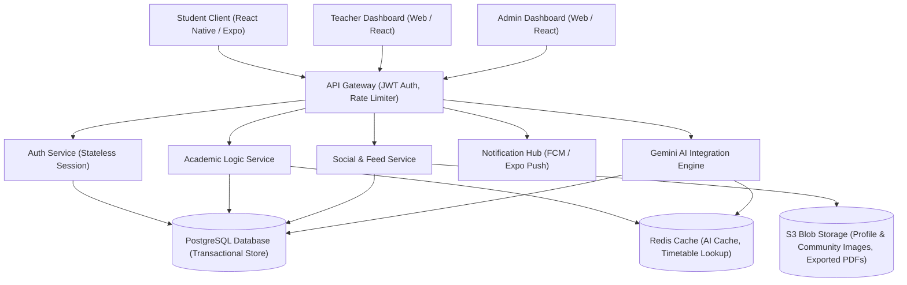
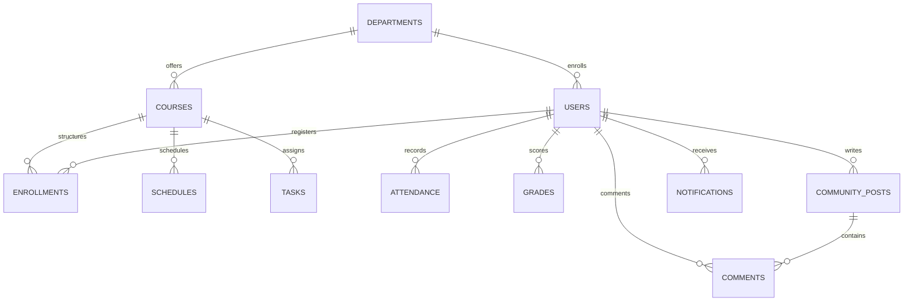

# UniMate Product Architecture & System Discovery Specifications

## 1. Product Architecture Overview

UniMate is a multi-role, institutional academic management platform designed to unify university administrations, teaching faculty, and students. The application stack features three primary components:
1. **Student Mobile Application** (React Native / Expo): A touch-first, micro-animated client built for academic tracking, peer achievement sharing, and contextual AI coaching.
2. **Teacher Web Dashboard** (React / Tailwind): A productivity dashboard for course management, class attendance entry, sessional assessment scoring, and moderation of the community feed.
3. **Admin Web Dashboard** (React / Tailwind): A centralized console for department provisioning, course scheduling, global announcements, and student/faculty directories.

### High-Level System Architecture



---

## 2. User Role Analysis

The platform implements Role-Based Access Control (RBAC) across three distinct user roles:

### A. Student (Mobile Client)
* **Objective**: Manage daily schedules, track grades/GPAs, record task progress, consult the AI Copilot for credit planning, view notices, and share milestones with peers.
* **Scope**: Read-only access to schedules and official grades; read-write access to private task checklist progress, GPA targets, community feed posts/comments, and profile details.
* **Key Actions**: Adjust CGPA target slider, toggle task progress markers, submit comments on achievement posts, query AI Copilot, trigger transcript PDF downloads.

### B. Teacher (Web Dashboard)
* **Objective**: Administrate academic courses, log class attendance, score sessional exams/labs, assign assignments, broadcast class announcements, and monitor community posts.
* **Scope**: Full CRUD on sessional grades and attendance for assigned courses; access to moderate community posts flagged by students in their department.
* **Key Actions**: Submit attendance logs, publish new student tasks, edit midterm scores, post class announcements, approve or reject pending community posts.

### C. Admin (Web Dashboard)
* **Objective**: Oversee university-wide configuration, schedule master timetables, configure departments, provision accounts, and manage institutional compliance policies.
* **Scope**: Full CRUD across all database schemas; absolute authority on final results release, system configurations, and moderation disputes.
* **Key Actions**: Import student/teacher rosters, configure course lists, allocate classrooms to time slots, publish campus-wide event reminders, lock/unlock grading systems, override system moderation states.

---

## 3. Module Breakdown

### A. Authentication & Onboarding Module
* **Core Logic**: Stateless JWT session tokens with auto-refresh mechanism. Enforces a "Security Clean State" flow: if the database flag `needsPasswordReset` is true, the mobile app locks navigation behind `SetPasswordScreen` until default credentials are replaced.
* **Vulnerability Identified in Codebase**: Token duration is hardcoded in the frontend with no secure token storage. A secure keychain configuration (using Expo SecureStore) is recommended.

### B. Home Dashboard Module
* **Core Logic**: Renders an aggregated daily brief. Combines the Gemini Daily Briefing summary, active attendance alerts (< 75%), a preview of today's schedule, pending tasks, and active announcements.
* **Backend Pipeline**: Resolves student courses, joins sessional stats, calculates attendance rates, and returns a unified dashboard model in a single request.

### C. Schedule Module
* **Core Logic**: Implements an interactive date strip mapped to the academic calendar. Displays daily class sessions (location, teacher, time).
* **AI Feature**: Integrates the Timeline Optimizer. If a task is due within 4 days, the backend schedules dynamic "AI Study Prep Blocks" into the student's empty timetable slots.

### D. Task Module
* **Core Logic**: Unified system tracking three sessional task types: assignments, quizzes, and projects.
* **Fields**: `title`, `description`, `course`, `dueDate`, `priority` (Critical, Moderate, Normal), `complexity` (High, Medium, Low), `status` (Draft, Published, In Review, Completed, Overdue).
* **Workflow Logic**: Student flags a task as `Completed` (writes progress to 100%), which shifts the state to `In Review`. The Teacher reviews submissions, assigns marks, and shifts status to `Completed` (graded), sending a high-priority push notification.

### E. Grade & GPA Module
* **Core Logic**: Dynamic transcript calculator. Allows students to project target CGPAs using a slider. The backend calculates required future term GPAs using:
  $$\text{Required GPA} = \frac{(\text{Target CGPA} \times (\text{Completed Credits} + \text{Remaining Credits})) - (\text{Current CGPA} \times \text{Completed Credits})}{\text{Remaining Credits}}$$
  The AI matches this required GPA against historical performance to suggest study intensities (`balanced` | `high` | `aggressive`).

### F. Attendance Module
* **Core Logic**: Tracks class-by-class attendance records (Present, Absent, Leave). Computes the attendance percentage:
  $$\text{Attendance \%} = \frac{\text{Attended Classes}}{\text{Total Delivered Classes}} \times 100$$
  Triggers a Critical alert if the percentage is below the university requirement (75%).

### G. Announcements & Events Module
* **Core Logic**: Academic and social bulletin system. Announcements are scoped at the department or class level. Events represent physical campus activities with location data (e.g., Exam Hall, Labs) and color-coded cards.

### H. Community Feed Module
* **Core Logic**: Peer-to-peer achievement feed. Students share achievements categorized with specific badges (Internship, Competition, GPA Milestone, Project, Certification).
* **Moderation Pipeline**: To protect campus culture, posts containing images or links enter a `Pending` state. The Teacher Dashboard serves as a moderation queue. Once approved, posts are visible on the main feed.

### I. AI Insights Module
* **Core Logic**: Integrates Gemini APIs with raw database contexts. Feeds students real-time suggestions based on current progress, attendance trends, and deadlines.

### J. Notifications Module
* **Core Logic**: A push and pull notification engine. Generates real-time alerts for grade publications, attendance drops, imminent deadlines, and community interactions.

---

## 4. Screen Breakdown (Student Mobile App)

| Screen File / Component | Objective | Key UI Components Rendered | Required API Endpoints |
| :--- | :--- | :--- | :--- |
| **Login.jsx** | Authenticate credentials. | Input fields for Email, Password, Tenant Code; "Keep Signed In" checkbox. | `POST /api/v1/auth/login` |
| **SetPasswordScreen.jsx** | Force secure password replacement on first login. | Input fields for New Password, Confirm Password; real-time validation indicator. | `POST /api/v1/auth/set-password` |
| **HomeScreen.js** | Aggregate daily overview. | AI Briefing Card, Classes Banner, Attendance Risk Alerts, Pending Tasks preview, Upcoming Events scroll list. | `GET /api/v1/users/me`<br>`GET /api/v1/ai/briefing`<br>`GET /api/v1/classes?date=YYYY-MM-DD` |
| **ScheduleScreen.js** | View timetable. | Month navigation header, horizontal day selection scroll strip, vertical timeline of classes with AI Prep slots. | `GET /api/v1/classes?date=YYYY-MM-DD`<br>`POST /api/v1/ai/schedule/study-blocks` |
| **TasksScreen.js** | Track tasks. | Category filter pills (All, Pending, Done, Overdue), Task progress sliders, difficulty badges. | `GET /api/v1/assignments/my`<br>`POST /api/v1/assignments/:id/progress` |
| **GradesScreen.js** | View current grades. | Current Term GPA hero card, Dean's List eligibility badge, course evaluation cards with sessional grades. | `GET /api/v1/grades/my` |
| **AllSemesters.jsx** | View transcripts. | CGPA summary header, bar chart of GPA trends over time, vertical semester history accordion, transcript PDF download button. | `GET /api/v1/grades/all-semesters`<br>`GET /api/v1/grades/transcript/pdf` |
| **SetGPAGoalScreen.js** | Plan GPA targets. | Interactive target CGPA slider, study intensity selector pills (balanced, high, aggressive), required GPA output card, strategic AI feedback block. | `POST /api/v1/grades/gpa-goals`<br>`POST /api/v1/ai/grades/projection` |
| **UpdatesScreen.jsx** | Switch bulletins/feed. | Segmented tab switcher (Announcements vs. Community Feed). | *(Wrapper Screen)* |
| **AnnouncementsTab.jsx** | Read notices. | Announcement bulletins categorized by scope (Department/Class) and type (Important, Event, General). | `GET /api/v1/announcements` |
| **CommunityTab.jsx** | Share achievements. | Achievement filter bar, social feed cards with image headers, like/comment counts, slide-up comments sheet. | `GET /api/v1/community/posts`<br>`POST /api/v1/community/posts/:id/like`<br>`GET /api/v1/community/posts/:id/comments`<br>`POST /api/v1/community/posts/:id/comments` |
| **CreateCommunityPost.jsx** | Post achievements. | Achievement category picker, Title and Body inputs, image upload button, live card preview. | `POST /api/v1/community/posts` |
| **NotificationsScreen.js** | Manage notifications. | Grouped alerts (Critical, High, Medium, Low), Mark All as Read button, swipe-to-delete actions. | `GET /api/v1/notifications`<br>`POST /api/v1/notifications/:id/read`<br>`POST /api/v1/notifications/read-all` |
| **ProfileScreen.js** | View user profile. | User avatar, enrollment details, emergency contact details, parent/guardian contact cards. | `GET /api/v1/users/me` |
| **AttendanceScreen.js** *(Missing Screen)* | Review attendance details. | Overall attendance percentage ring, subject-by-subject logs, prediction calculator for required classes. | `GET /api/v1/attendance/my`<br>`GET /api/v1/ai/copilot` *(contextual query)* |

---

## 5. Workflow Diagrams (Text Format)

### A. Task Submission & Grading Workflow
```text
[Teacher Dashboard]                       [Student App]                           [Teacher Dashboard]
Create & Publish Task  ────────────────>  View task in Tasks Tab ────────────────> Mark task as Graded
                       (Notification)     Update progress to 100%                 Assign sessional score
                                          (Status changes: Pending -> In Review)  (Status changes: Completed)
                                                                                  Sends Push Notification ──> Student App
```

### B. Attendance Risk Notification Pipeline
```text
[Teacher Dashboard]                       [System Cron Job]                       [Student App]
Record student absent  ────────────────>  Re-calculate Attendance %  ───────────> Render High Risk banner
                                          Evaluate risk rules:                    Send high-priority warning
                                          If Attendance < 75% ──> State: Critical  Push Notification
```

### C. Community Post Moderation Workflow
```text
[Student App]                             [Moderation Engine]                     [Teacher/Admin Dashboard]
Compose Post + Image  ─────────────────>  Evaluate image safety ────────────────> Appears in Moderation Queue
                                          (Sets state: Pending)                   Review text & media attachments
                                                                                  Approve: Set state -> Approved
                                                                                  Reject: Set state -> Rejected
                                                                                  (Approved posts appear on feed)
```

### D. AI Grade Projection & Recalibration Flow
```text
[Student App]                             [API Service]                           [Gemini AI Engine]
Select Target CGPA  ──────────────────>   Fetch current academic data  ─────────> Compute required GPA
Select intensity vigor                    (Completed credits, historic GPAs)      Generate study recommendations
                                                                                  Verify math parameters
                                                                                  Update AI Briefing feed
                                                                                  Return target dataset ──> Student App
```

---

## 6. Database Design



### Table: `departments`
* **Owner**: Admin
* **Description**: Academic organizational divisions.
* **Fields**:
  * `id` (UUID, Primary Key)
  * `name` (VARCHAR, Unique)
  * `code` (VARCHAR, Unique)
* **CRUD**: Admin (CRUD), Student/Teacher (Read)

### Table: `users`
* **Owner**: Admin
* **Description**: Platform identity profiles.
* **Fields**:
  * `id` (UUID, Primary Key)
  * `email` (VARCHAR, Unique)
  * `password_hash` (VARCHAR)
  * `name` (VARCHAR)
  * `role` (VARCHAR) -- 'student' | 'teacher' | 'admin'
  * `registration_number` (VARCHAR, Nullable)
  * `department_id` (UUID, Foreign Key -> `departments.id`)
  * `needs_password_reset` (BOOLEAN, Default: TRUE)
  * `guardian_details` (JSONB) -- Father's name, phone, emergency contact
* **CRUD**: Admin (CRUD), User (Read, Update limited to profile properties)

### Table: `courses`
* **Owner**: Admin
* **Description**: Academic courses.
* **Fields**:
  * `id` (UUID, Primary Key)
  * `code` (VARCHAR, Unique)
  * `name` (VARCHAR)
  * `credit_hours` (INTEGER)
  * `department_id` (UUID, Foreign Key -> `departments.id`)
* **CRUD**: Admin (CRUD), Student/Teacher (Read)

### Table: `enrollments`
* **Owner**: Admin
* **Description**: Academic enrollments.
* **Fields**:
  * `id` (UUID, Primary Key)
  * `student_id` (UUID, Foreign Key -> `users.id`)
  * `course_id` (UUID, Foreign Key -> `courses.id`)
  * `semester_id` (VARCHAR) -- e.g., 'Semester 8'
  * `status` (VARCHAR) -- 'active' | 'completed' | 'dropped'
* **CRUD**: Admin (CRUD), Student/Teacher (Read)

### Table: `schedules`
* **Owner**: Admin
* **Description**: Weekly timetable schedules.
* **Fields**:
  * `id` (UUID, Primary Key)
  * `course_id` (UUID, Foreign Key -> `courses.id`)
  * `teacher_id` (UUID, Foreign Key -> `users.id`)
  * `room` (VARCHAR)
  * `day_of_week` (INTEGER) -- 1 (Mon) to 7 (Sun)
  * `start_time` (TIME)
  * `end_time` (TIME)
* **CRUD**: Admin (CRUD), Student/Teacher (Read)

### Table: `tasks`
* **Owner**: Teacher
* **Description**: Course tasks.
* **Fields**:
  * `id` (UUID, Primary Key)
  * `course_id` (UUID, Foreign Key -> `courses.id`)
  * `teacher_id` (UUID, Foreign Key -> `users.id`)
  * `title` (VARCHAR)
  * `description` (TEXT)
  * `due_date` (TIMESTAMP)
  * `priority` (VARCHAR) -- 'Critical' | 'Moderate' | 'Normal'
  * `complexity` (VARCHAR) -- 'High' | 'Medium' | 'Low'
  * `weight` (NUMERIC) -- Sessional percentage weight (e.g., 10%)
* **CRUD**: Teacher (CRUD), Student (Read)

### Table: `student_tasks`
* **Owner**: Student / Teacher
* **Description**: Student task tracking.
* **Fields**:
  * `id` (UUID, Primary Key)
  * `task_id` (UUID, Foreign Key -> `tasks.id`)
  * `student_id` (UUID, Foreign Key -> `users.id`)
  * `progress_percent` (INTEGER, Default: 0)
  * `status` (VARCHAR) -- 'pending' | 'in_review' | 'done' | 'overdue'
  * `marks_secured` (NUMERIC, Nullable)
* **CRUD**: Student (Read, Update progress), Teacher (Read, Update status/marks), Admin (Read)

### Table: `attendance`
* **Owner**: Teacher
* **Description**: Class-by-class attendance records.
* **Fields**:
  * `id` (UUID, Primary Key)
  * `student_id` (UUID, Foreign Key -> `users.id`)
  * `course_id` (UUID, Foreign Key -> `courses.id`)
  * `date` (DATE)
  * `status` (VARCHAR) -- 'Present' | 'Absent' | 'Leave'
* **CRUD**: Teacher (CRUD), Student (Read)

### Table: `grades`
* **Owner**: Teacher
* **Description**: Consolidated course grades.
* **Fields**:
  * `id` (UUID, Primary Key)
  * `enrollment_id` (UUID, Foreign Key -> `enrollments.id`)
  * `midterm_score` (NUMERIC)
  * `assignment_total` (NUMERIC)
  * `quiz_total` (NUMERIC)
  * `final_exam_score` (NUMERIC, Nullable)
  * `gpa` (NUMERIC, Nullable)
  * `letter_grade` (VARCHAR, Nullable)
* **CRUD**: Teacher (CRUD), Admin (CRUD, Lock final grades), Student (Read)

### Table: `community_posts`
* **Owner**: User (Author)
* **Description**: Social milestone shares.
* **Fields**:
  * `id` (UUID, Primary Key)
  * `author_id` (UUID, Foreign Key -> `users.id`)
  * `type` (VARCHAR) -- 'internship' | 'competition' | 'gpa_milestone' | 'project_completion' | 'certification' | 'custom'
  * `title` (VARCHAR)
  * `body` (TEXT)
  * `image_url` (VARCHAR, Nullable)
  * `likes_count` (INTEGER, Default: 0)
  * `comments_count` (INTEGER, Default: 0)
  * `moderation_state` (VARCHAR) -- 'Pending' | 'Approved' | 'Rejected'
* **CRUD**: User (Create, Read-only if Approved, Delete own), Teacher/Admin (Read, Update moderation status)

### Table: `comments`
* **Owner**: User (Author)
* **Description**: Comments on community posts.
* **Fields**:
  * `id` (UUID, Primary Key)
  * `post_id` (UUID, Foreign Key -> `community_posts.id`)
  * `author_id` (UUID, Foreign Key -> `users.id`)
  * `text` (TEXT)
* **CRUD**: User (Create, Read, Delete own), Teacher/Admin (Read, Delete flags)

### Table: `notifications`
* **Owner**: System
* **Description**: User notification center.
* **Fields**:
  * `id` (UUID, Primary Key)
  * `user_id` (UUID, Foreign Key -> `users.id`)
  * `title` (VARCHAR)
  * `body` (TEXT)
  * `priority` (VARCHAR) -- 'CRITICAL' | 'HIGH' | 'MEDIUM' | 'LOW'
  * `is_read` (BOOLEAN, Default: FALSE)
  * `entity_type` (VARCHAR) -- 'grade' | 'task' | 'announcement'
  * `entity_id` (UUID)
* **CRUD**: System (Create), User (Read, Update read status)

---

## 7. API Design

### Module: Authentication
* **POST `/api/v1/auth/login`**
  * *Request*: `{ "email": "student@university.edu", "password": "...", "tenantCode": "UOS" }`
  * *Response (200 OK)*: `{ "success": true, "data": { "accessToken": "...", "refreshToken": "...", "user": { "id": 101, "name": "Saif ur Rehman", "role": "student", "needsPasswordReset": false } } }`
  * *Access*: Public
* **POST `/api/v1/auth/set-password`**
  * *Request*: `{ "newPassword": "SecurePassword123!" }`
  * *Response (200 OK)*: `{ "success": true, "message": "Password updated successfully." }`
  * *Access*: Authenticated (`needsPasswordReset` bypass allowed)

### Module: Academic Management
* **GET `/api/v1/users/me`**
  * *Response (200 OK)*: `{ "success": true, "data": { "name": "Saif", "registrationNumber": "...", "cgpa": 3.82, "creditsEnrolled": 48, "personal": {...}, "guardian": {...} } }`
  * *Access*: Student, Teacher, Admin
* **GET `/api/v1/classes`**
  * *Query*: `?date=YYYY-MM-DD`
  * *Response (200 OK)*: `{ "success": true, "data": [ { "id": "...", "courseName": "...", "room": "...", "startTime": "...", "endTime": "..." } ] }`
  * *Access*: Student, Teacher, Admin

### Module: Academic Tracking (Grades & GPAs)
* **GET `/api/v1/grades/my`**
  * *Response (200 OK)*: `{ "success": true, "data": { "semesterGpa": 3.88, "courses": [ { "name": "Web Dev", "grade": "A-", "components": [...] } ] } }`
  * *Access*: Student
* **GET `/api/v1/grades/all-semesters`**
  * *Response (200 OK)*: `{ "success": true, "data": { "cgpa": 3.82, "semesters": [...] } }`
  * *Access*: Student, Teacher, Admin
* **POST `/api/v1/grades/gpa-goals`**
  * *Request*: `{ "targetCgpa": 3.65, "intensity": "balanced" }`
  * *Response (200 OK)*: `{ "success": true, "message": "Goal recorded successfully.", "data": { "recalibratedTasksCount": 8 } }`
  * *Access*: Student
* **GET `/api/v1/grades/transcript/pdf`**
  * *Response (200 OK)*: Binary PDF Stream
  * *Access*: Student, Admin

### Module: Social Feed (Announcements & Community)
* **GET `/api/v1/announcements`**
  * *Response (200 OK)*: `{ "success": true, "data": [ { "id": "...", "title": "...", "message": "...", "scope": "department" } ] }`
  * *Access*: Student, Teacher, Admin
* **POST `/api/v1/announcements`**
  * *Request*: `{ "title": "...", "message": "...", "scope": "department", "type": "important" }`
  * *Response (201 Created)*: `{ "success": true }`
  * *Access*: Teacher, Admin
* **GET `/api/v1/community/posts`**
  * *Response (200 OK)*: `{ "success": true, "data": [ { "id": "...", "authorName": "...", "title": "...", "likesCount": 24, "liked": false } ] }`
  * *Access*: Student, Teacher, Admin
* **POST `/api/v1/community/posts`**
  * *Request*: `{ "type": "internship", "title": "...", "body": "...", "image": "Base64String" }`
  * *Response (201 Created)*: `{ "success": true, "message": "Post submitted for moderation approval." }`
  * *Access*: Student, Teacher
* **POST `/api/v1/community/posts/:id/like`**
  * *Response (200 OK)*: `{ "success": true, "liked": true, "likesCount": 25 }`
  * *Access*: Student, Teacher, Admin
* **GET `/api/v1/community/posts/:id/comments`**
  * *Response (200 OK)*: `{ "success": true, "data": [...] }`
  * *Access*: Student, Teacher, Admin
* **POST `/api/v1/community/posts/:id/comments`**
  * *Request*: `{ "text": "Congrats!" }`
  * *Response (201 Created)*: `{ "success": true, "data": {...} }`
  * *Access*: Student, Teacher, Admin

### Module: Gemini AI Endpoints
* **GET `/api/v1/ai/briefing`**
  * *Response (200 OK)*: `{ "briefContent": "Heavy day ahead — 3 classes. Prep for your Web Dev quiz." }`
  * *Access*: Student
* **POST `/api/v1/ai/copilot`**
  * *Request*: `{ "query": "Will I pass Web Dev if I skip today's lab?", "activeCourseId": "course-402" }`
  * *Response (200 OK)*: `{ "reply": "...", "suggestedChips": ["How do I calculate targets?", "What is my attendance rate?"] }`
  * *Access*: Student, Teacher
* **POST `/api/v1/ai/grades/projection`**
  * *Request*: `{ "targetCgpa": 3.65, "studyIntensity": "balanced" }`
  * *Response (200 OK)*: `{ "requiredGpa": 3.90, "difficultyMultiplier": 1.2, "percentageHigherThanHistory": 19, "strategicAdvice": "..." }`
  * *Access*: Student
* **POST `/api/v1/ai/schedule/study-blocks`**
  * *Request*: `{ "date": "2026-05-18" }`
  * *Response (200 OK)*: `{ "insertedPrepBlocks": [ { "title": "📚 AI Prep: Web Dev", "startTime": "11:00", "endTime": "11:15", "room": "Library Quiet Room" } ] }`
  * *Access*: Student
* **POST `/api/v1/ai/tasks/prioritize`**
  * *Response (200 OK)*: `[ { "taskId": "...", "priorityScore": 95, "reason": "Due in 24 hours & weighted at 15%" } ]`
  * *Access*: Student
* **GET `/api/v1/ai/announcements/summary`**
  * *Response (200 OK)*: `{ "summary": "Focus on the Exam Registration notice published today. Submission is required." }`
  * *Access*: Student

---

## 8. Notification Architecture

```text
       Trigger Events                     Processing Core                     Delivery Clients
┌──────────────────────────┐         ┌──────────────────────────┐         ┌──────────────────────┐
│  • New Grade Released    │         │                          │         │  Student Client      │
│  • Attendance Drop <75%  │ ──────> │  Notification Service    │ ──────> │  (Push Notifications │
│  • Task Due (48h left)   │         │  - FCM Push Token Match  │         │  & System Drawer)    │
│  • Notice Posted         │         │  - Queue Serialization   │         └──────────────────────┘
└──────────────────────────┘         └──────────────────────────┘
```

### Notification Rules Schema
* **Grade Published Alert**:
  * *Trigger*: Grade record is completed/updated by Teacher.
  * *Priority*: HIGH.
  * *Message Payload*: `"New Grade Released: Your final grade for Web Development has been submitted."`
* **Attendance Critical Alert**:
  * *Trigger*: Attendance entry drops the cumulative course attendance rate below 75%.
  * *Priority*: CRITICAL.
  * *Message Payload*: `"Attendance Warning: Your attendance in Web Development has dropped to [Percent]%. Attendance under 75% disqualifies you from exams."`
* **Task Deadline Warning**:
  * *Trigger*: Task deadline is 48 hours away and student progress is under 100%.
  * *Priority*: MEDIUM.
  * *Message Payload*: `"Deadline Alert: Your task '[Task Title]' is due in 48 hours. Current progress is [Percent]%."`
* **AI Alert**:
  * *Trigger*: System notices an anomaly in performance or schedule (e.g., three consecutive low quiz marks).
  * *Priority*: LOW.
  * *Message Payload*: `"Unimate AI Notice: Your performance trend has adjusted. Tap to view study suggestions."`

---

## 9. AI Architecture (Gemini Integration)

```text
┌──────────────────────┐
│  App Data Ingestion  │ ──> Student profile, Timetables, Course Sessionals, Attendance Rates
└──────────────────────┘
           │
           ▼
┌──────────────────────┐
│  Prompt Engineering  │ ──> Inject System Prompts + Core Institutional Regulations
└──────────────────────┘
           │
           ▼
┌──────────────────────┐
│  Gemini API Call     │ ──> Context Processing and Response Generation
└──────────────────────┘
           │
           ▼
┌──────────────────────┐
│  Validation Layer    │ ──> Enforce Strict JSON output, calculate math verification bounds
└──────────────────────┘
           │
           ▼
┌──────────────────────┐
│  Caching Service     │ ──> Store briefings in Redis (TTL: 1 Hour)
└──────────────────────┘
```

### Verification & Caching Protocols
1. **Math Compliance Verification**: For the **GPA Projection Engine**, the backend must calculate the target math directly:
   $$\text{gpaRequired} = \frac{(\text{targetCgpa} \times \text{totalCredits}) - (\text{currentCgpa} \times \text{completedCredits})}{\text{remainingCredits}}$$
   The LLM output is compared against this value. If the LLM output deviates by more than $\pm 0.01$, the LLM text is discarded and regenerated using a structural fallback.
2. **Refresh & Caching Strategy**:
   * **Daily Briefing**: Cached in Redis with a Time-To-Live (TTL) of 1 hour, or invalidated on grade/attendance edits.
   * **Timeline Optimizer**: Recalculated dynamically once per day or when tasks are completed.
   * **Copilot Interactive Companion**: Real-time stateless invocations.

---

## 10. Teacher Dashboard Requirements

To support the student experience, the **Teacher Web Dashboard** requires specific management interfaces:

### A. Attendance Management Screen
* **Objective**: Manage daily attendance sheets.
* **Fields**: Date picker, course selection, list of enrolled students with checkboxes (Present/Absent/Leave).
* **Sync Action**: Saving this sheet triggers the attendance risk evaluation job in the background.

### B. Gradebook Screen
* **Objective**: Input sessional marks.
* **Fields**: Student list with individual inputs for: Quiz 1-4, Assignments 1-4, Project/Labs, Midterm, and Final Exam.
* **Sync Action**: Grading updates recalculate the student's current GPAs and send push notifications.

### C. Course Planner & Task Sheet
* **Objective**: Configure homework assignments.
* **Fields**: Title, Description, Deadline, Priority dropdown, Complexity dropdown, and Grade Weight (%).
* **Sync Action**: Creating a task sends a push notification to all enrolled students.

### D. Community Feed Moderation Queue
* **Objective**: Review student post submissions.
* **Fields**: List of posts in `Pending` state, display of text and uploaded media, "Approve" button, "Reject" button with comments.

---

## 11. Admin Dashboard Requirements

The **Admin Web Dashboard** serves as the system control center:

### A. Academic Setup Console
* **Objective**: Define department catalogs, courses, and credits.
* **Actions**: Import departments, map course identifiers to credits, assign course offerings to professors.

### B. Master Timetable Scheduler
* **Objective**: Manage classrooms and slots.
* **Actions**: Drag-and-drop course schedules to map timeslots, select physical rooms, check for scheduling conflicts.

### C. System Directory & User Management
* **Objective**: Administrate platform accounts.
* **Actions**: Provision accounts, upload CSV rosters, toggle account lockouts, trigger password reset overrides.

---

## 12. Role-Based Access Control (RBAC) Matrix

| Resource Entity | Student CRUD | Teacher CRUD | Admin CRUD | System / Service Actions |
| :--- | :--- | :--- | :--- | :--- |
| **users** | R (Update limited properties) | R | CRUD | Sync directories |
| **departments** | R | R | CRUD | - |
| **courses** | R | R | CRUD | - |
| **schedules** | R | R | CRUD | - |
| **tasks** | R (Update completion state) | CRUD | R | System checks deadlines |
| **attendance** | R | CRUD | R | Triggers alert warnings |
| **grades** | R | CRUD | CRUD (Verify & lock finals) | Evaluates Dean's List |
| **community_posts** | CRD (Own posts only) | RU (Moderation states) | CRUD | Scans images |
| **comments** | CRD (Own comments only) | RD (Moderation removal) | CRUD | - |
| **notifications** | RU (Mark read status) | C (System actions only) | C | Dispatches pushes |
| **ai_insights** | RC (Invoke calculations) | R | R | Evaluates cache |

---

## 13. Missing Features & Critical Gaps

During our system audit, we identified several gaps between the mobile application codebase and its architectural specifications:

1. **Missing Attendance Screen**: The `HomeScreen.js` contains navigating parameters pointing to an `Attendance` screen (`navigation.navigate("Attendance")`). However, **no Attendance screen code file exists**, and it is completely missing from `AppNavigator.jsx`.
2. **Community Report Pipeline Missing**: While the specifications describe post reporting for moderation, the `CommunityTab.jsx` component has no UI elements or endpoints to trigger a report.
3. **No Image Upload Storage Service**: The mobile app allows selecting images in post creation, but the API expects a static URL or binary payload without details on backend storage (e.g., S3 integration).
4. **Token Storage and Security Risk**: The authentication module stores credentials and tokens in temporary memory spaces. For production, these must be migrated to secure local storage.

---

## 14. Scalability Recommendations

1. **Database Indexing Plan**:
   * Add composite indexes on `attendance (student_id, course_id)` to speed up calculation routines.
   * Add indexes on `notifications (user_id, is_read)` to keep UI loading times low.
2. **Gemini Caching Architecture**:
   * Store student profile prompts in Redis cache. Since student schedules rarely change mid-semester, this reduces Gemini context payload sizes by 80%.
3. **Task Queue Processing**:
   * Push notification delivery can slow down server responses. Use an asynchronous message broker (e.g., BullMQ, RabbitMQ) to handle push notifications out-of-band.

---

## 15. Product Roadmap

```text
┌─────────────────────────────┐
│  Phase 1: Foundation (Q3)   │ ──> Build backend APIs, implement JWT Auth, create DB structures
└─────────────────────────────┘
               │
               ▼
┌─────────────────────────────┐
│  Phase 2: Core Academic (Q3)│ ──> Implement Course planning, Attendance entry, Grade calculator
└─────────────────────────────┘
               │
               ▼
┌─────────────────────────────┐
│  Phase 3: AI Copilot (Q4)   │ ──> Integrate Gemini, build GPA Goal tracking, optimize Timelines
└─────────────────────────────┘
               │
               ▼
┌─────────────────────────────┐
│  Phase 4: Social & Mod (Q4) │ ──> Launch Community Feed, build Moderation Dashboard
└─────────────────────────────┘
```
